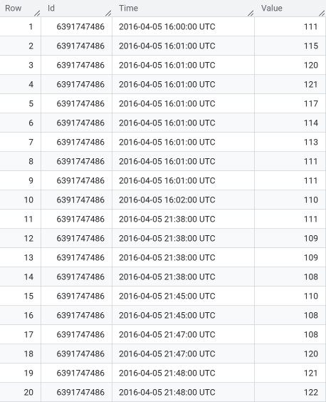

# Coursera_Case_Study
I analyze the data of Fitbit users to derive marketing insights for my stakeholders. This is a case study for my Google Data Analytics Certificate.
## Prompt
* You are a data analyst for a company called Bellabeat. Bellabeat makes wearable fitness devices.
* Your team has been asked to anazlyze trends in smart fitness device usage in an effort to help Bellabeat reach their target market more effectively.
* This data set about fitbit users is provided by the company: [https://www.kaggle.com/datasets/arashnic/fitbit]
* Questions:
    * What are some trends in smart device usage?
    * How could these trends apply to Bellabeat's customers?
    * How could these trends influence Bellabeat's marketing strategy?
### Phase One: Ask
* Are users wearing the watch as a fashionable accessory? Do they wear it all day?
* Do users frequently log their weight in the device?
* What time of day do users typically exercise?
* How far do users go during a workout?
* How long do users workout for?
* How hard do users workout?
* How much sleep do the users get per night?
### Phase Two: Prepare
* Is the data reliable?
    * For purposes of this case study, I will use this data set. However, it is important to note the we are trying to make a claim about Fitbit users. Therefore, our population would be 38.5 million people. If we wanted to make claims about this population with 95% certainty, we would need a sample size of at leat 385 participants. If this were a real life scenario, I would recommend that we find a more representative data set.
    * Further, the source of this data is Amazon Mechanical Turk. Therefore, this dataset is not random and it was not vetted for bias.
* Is the data the original set?
    * Yes
* Is the data comprehensive?
    * The data includes enough information to allow us to answer our questions about the users included.
* Is the data current?
    * This data set is updated annually.
### Phase Three and Four: Process and Analyze
* Are users wearing the watch as a fashionable accessory? Do they wear it all day?
    * For this task, we used the heartrate_seconds_merged.csv tables. There is one for the first date range (3/12-4/11), and one for the second date range (4/12-5/12). A preview of this table is shown below. A user must be wearing the watch for their heartrate to be tracked. Therefore, this table will show us how long each user wears their watch:
    * 
    * First, I cleaned this data by formatting the id’s to a number and expanded the date row to include all information.
    * Second, I uploaded the tables to Bigquery.
    * Third, I applied the following steps to the data from 3/12-4/11:
         * Find the number of days that each user was wearing their fitbit during the date range:
