# Power BI KPI Dashboard
I transform raw sales data in to clean visuals that show trends over time allowing stakeholders to make data-driven decisions more quickly and efficiently.
## Prepare the Data
* Below is a snip of the raw data from the KPI (Key Performance Indicator) sales tracker for the department. This is sent out daily by a team of analysts. It includes month to date sales data for each agent in the department. I have randomized the information in this data using the =RAND() function in Excel.
* 
* My end product in Power BI will show Month to Date and Month over Month trends for sales agents, supervisors, and the entire department. 
   * For the month over month portion of my Power BI report, I will need to create one table with all of end of month Sales trackers stacked on top of one another. I will also add a date column so that each tracker is date-stamped after it has been appended to the larger table.
      * The end of month sales trackers for 2023, 2024 and 2025 were contained in separate files on my desktop based on their year as shown below:
      * 
      * For each year's data, I performed the following steps to create one table per year:
        *  Load the sales trackers in to power query excel.
        *  Change the first row to headers
        *  Close and apply the power query changes
        *  In Excel, I confirmed that the columns from all appended trackers aligned. Once confirmed, I filtered the data to show only the rows with the column headers from the appended sales trackers and deleted these rows since they were no longer needed
        *  Added a column to the left of the file name column.
          *  As shown below, I extracted the date from the file name by using =TEXTBEFORE(TEXTAFTER(C2, "Tracker "), ".xlsx") and dragging the formula down to fill all of column B. I then copied the results in column B and pasted values only in column A. I used find and replace to find all "."  in column A and replace them with "/". I formatted column A as a date and deleted column B:
          *  
      *  After completing these steps for each year, I combined the resulting year files in to one file containing a table that stacked all end of month sales trackers from January 2023 - July 2025.
    *  For the Month to Date portion of my Power BI report, I applied the same month over month steps to append all trackers from the current month in to one table. This resulted in one month to date table with all of the current month's trackers stacked and time stamped.
    *  I pulled these files in to Power BI using Power Query. I created one Query for Month to Date and another for Month over Month.
## Power BI Model Design
* My finished product would have 6 pages. Left to Right: Department month over month (department name redacted), Department month to date (department name redacted), supervisor month over month, supervisor month to date, agent month over month, and agent month to date as shown below:
*  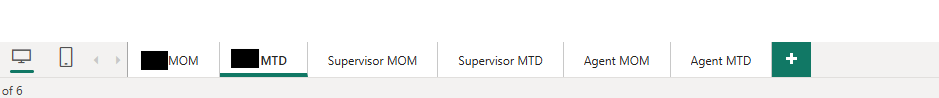
    *  All pages except for the department pages have a slicer. For the supervisor pages, the slicer filters by manager. For the agent pages, the slicer filters by agent.
    *   
*  I created measures using DAX
    *  This dashboard tracks a total of 9 sales KPI's, but, for purposes of this portfolio, I will share my measure creation process using only conversion as a focal point.
    *  _Agent Orders Measure_ (Redacted column name is the name of the orders column):
    *  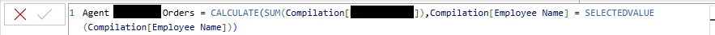
    *  _Agent Calls Measure_
    *  
    *  _Agent Conversion Measure_:
    *  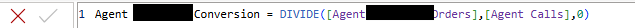
*  I set up a bookmark navigator (outlined in green). Each button within the bookmark navigator selects a different KPI and reveals that KPI's chart for the agent selected in the slicer. I designed the line charts for each KPI by dragging the measure to the y-axis and the date to the x-axis (outlined in red). Power BI automatically recognized the date heirarchy which allows me to change the time perspective as needed:
    *  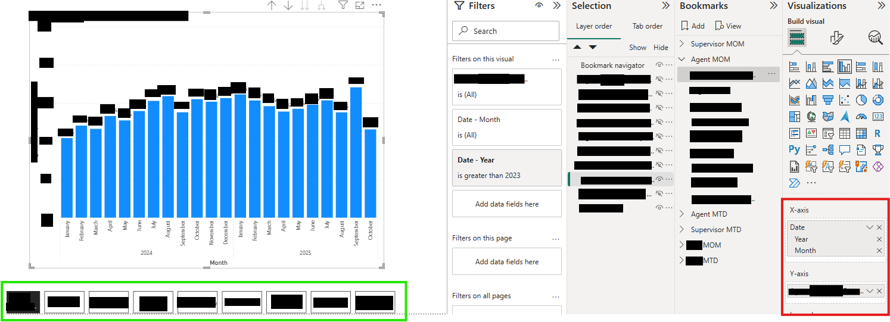
*  I tailored my selection settings with the following steps:
    * Group the bookmarks by page (outlined in green)
    * Change bookmark settings to display, current page, and all visuals to ensure all visuals are controlled by the bookmarks and the bookmark navigator (highlighted in yellow).
    * Click on each bookmark and hide or unhide visuals to ensure the proper visual is showing for each bookmark (Outlined in red). Update the bookmark. 
    * 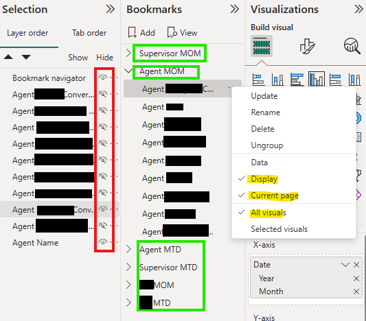
* I formatted my visuals with the following steps:
    * Set the y-axis minimum and maximum
    * Added data labels
    * Formatted the KPI to a percentage (if applicable)
* Below is the final product after the report is published to the department. Agents and supervisors can now go to the report, navigate to a month over month or month to date tab, select a name using the slicer, and use the button navigator to select a KPI. This will show them a trend over time based on their selections:
* 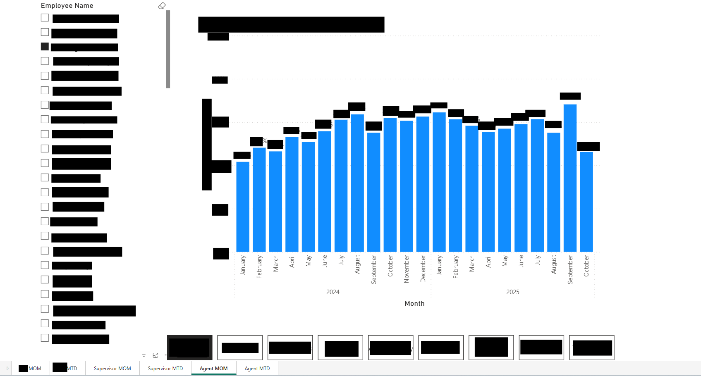
## Updating the Model
* Each time a new sales tracker is released, I update the month to date data. Each time an end of month sales tracker is released, I update the month over month data. I make these updates with the following steps:
    * Make sure the new tracker's columns match my data in the Power BI model
    * Add the newly cleaned tracker to Power BI using get data
    * Name the new tracker
    * Append the query adding the new tracker
    * Save and publish
  
# Coursera_Case_Study
I analyze the data of Fitbit users to derive marketing insights for my stakeholders. This is a case study for my Google Data Analytics Certificate. To complete this task, I used the 6 step data analyses process outlined in the course: ask, prepare, process, analyze, share, act. 
## Prompt
* You are a data analyst for a company called Bellabeat. Bellabeat makes wearable fitness devices.
* Your team has been asked to anazlyze trends in smart fitness device usage in an effort to help Bellabeat reach their target market more effectively.
* A data set about Fitbit users is provided by the company.
* Questions:
    * What are some trends in smart device usage?
    * How could these trends apply to Bellabeat's customers?
    * How could these trends influence Bellabeat's marketing strategy?
### Phase One: Ask
* Are users wearing the watch as a fashionable accessory? Do they wear it all day?
* Do users frequently log their weight in the device?
* What time of day do users typically exercise?
* How far do users go per day?
* How much sleep do the users get per night?
### Phase Two: Prepare
* Is the data reliable?
    * For purposes of this case study, I will use the dataset provided. However, it is important to note the we are trying to make a claim about Fitbit users. Therefore, our population would be 38.5 million people. If we wanted to make claims about this population with 95% certainty, we would need a sample size of at least 385 participants. If this were a real life scenario, I would recommend that we find a more representative data set.
    * Further, the source of this data is Amazon Mechanical Turk. Therefore, this dataset is not random and it was not vetted for bias.
* Is the data the original set?
    * Yes
* Is the data comprehensive?
    * The data includes enough information to allow us to answer our questions about the users included.
* Is the data current?
    * This data set is updated annually.
### Phase Three and Four: Process and Analyze
* Are users wearing the watch as a fashionable accessory? Do they wear it all day?
    * For this task, I used the heartrate_seconds_merged.csv tables. There is one for the first date range (3/12-4/11), and one for the second date range (4/12-5/12). A preview of this table is shown below. A user must be wearing the watch for their heartrate to be tracked. Therefore, this table will show us how long each user wears their watch:
    * 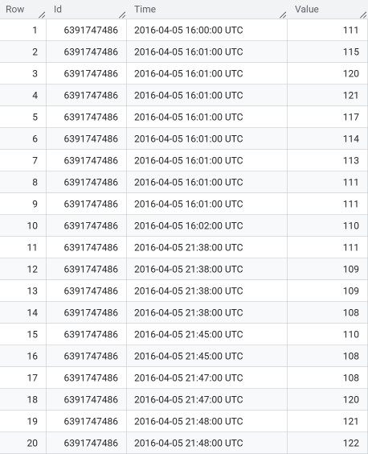
    * First, I cleaned this data by formatting the id’s to a number and expanded the date row to include all information.
    * Second, I uploaded the tables to Bigquery.
    * Third, I applied the following steps to the datasets for both date ranges:
         * I found the number of days that each user was wearing their fitbit during the date range.
            * To do this, I applied the following SQL query to the heartrate table:
            * 
            * Below is the table created by this query:
            * 
                 * I then ran the following query on the table above to find the total number of days per user during the range:
                 * 
                 * Below is the table that resulted from running this query:
                 * 
         * Now that I knew the total number of days per user for this date range, I needed to find the number of hours that each user wore the watch during the date range.
            *  To do this, I ran the following query on the original heart rate table:
            *  
            *  This resulted in the following table with the start and end time on each day for each user:
            *  
            *  Then, I ran the following query on the table above to add the total duration per user:
            *  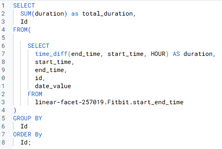
            *  This resulted in the following table:
            *  
            *  I joined this table with the day count table using the following query:
            *  
            *  This resulted in a table that showed the Fitbit Id, total days the fitbit was used, and the total hours the fitbit was used. Below is a snip of the table for the 3/12-4/11 dataset:
            *  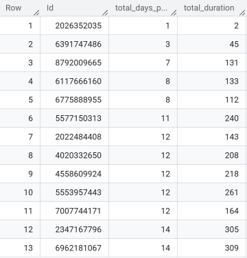
         * Since I applied these steps to both date ranges, I ended up with 2 tables.
            * I combined these tables in Excel.  
            * In a new tab, I used a sumif function to total the number of hours per user in one column and the number of days per user in another.
               * I added a third column that divides the hours used by the days used to find each user's average daily use.
            * In a new sheet, I created a table that used a countif function to add the number of users that fell within each usage range as shown below:
            *  
            * I used Excel to create a chart from this table as shown below:
            * 
   * This chart shows us that most Fitbit users wear their watch between 12 and 24 hours per day. My recommendation to my stakeholders would be to market their product to users who are looking for a fashionable watch that they can wear all day, not just while working out.
* How often are users utilizing the weight log function?
   * To answer this, I prepared the weight log data sets by extracting the date from the column with Date-Time using flash fill in Excel. Then, I used the following sql query to merge the two tables, and count the number of distinct id’s that fell within each date range. This showed the number of unique user Id's that used the weight log each week. I chose to measure this on a weekly basis because this is a common weigh in frequency for someone who is trying to lose weight.
   * 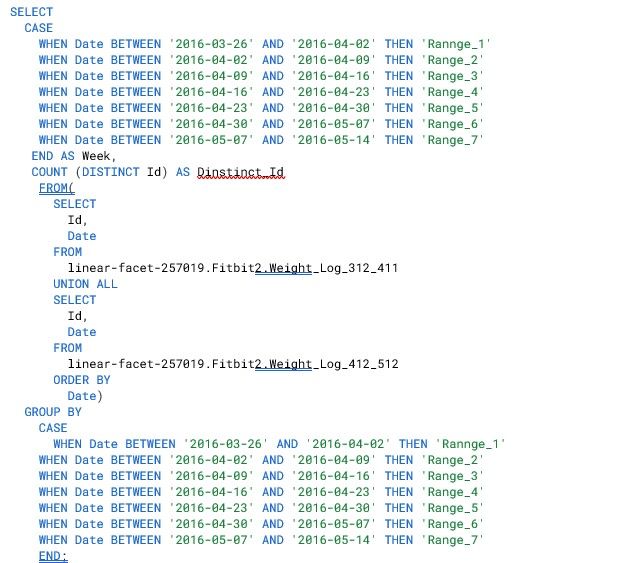
   * This query created a table that I opened in Excel. In Excel, I added a percentage column that divided the number of unique users each week by the population size (30), and created a chart that plotted the weekly percentages on a line graph as shown below:
   * 
   * The chart above shows that only a very small percentage of our population is using the weight log function. Based on this data, I would recommend that we investigate why this function is not being used. It could mean that only a small percentage of our population is trying to lose weight. Alternatively, it could mean that the weight log funtion is not easy to use. We could search for datasets that shed light on the percentage of Fitbit users that use the device for weight loss or create a survey that attempts to uncover how Fitbit users feel about the weight log function. This information could provide valuable insight about whether or not we should market to people who are trying to lose weight. Depending on what we find, it could also mean a step toward improving the weight log function for our device.
* What time of day do users exercise?
   * To answer this question, I used the hourly calories tables for both date ranges.
      * I started by opening these tables in Excel. Then, I extracted the hour from the date-hour column using flash fill.
      * Then, I downloaded the tables in to Bigquery and ran the following query on them:
      * 
      * The query above combines the datasets from both date ranges, averages the calories for each hour, and groups the results by hour. I opened this table in Excel and created the following graph:
      * 
   * Our population burns the most calories at 7PM each day. Based on this information, I would recommend that my stakeholders market to working professionals. Our advertisements could be timed to get the most visibility by showing them in gyms at 7PM or, right after, when these users are coming home from the gym. This information could also inform decisions about the watch design. It might make sense to create a watch that can be worn while at work so that users do not need to remember to put it on before leaving for their workout.
* How far do users go per day?
   * To answer this question, I used the daily activity datasets. These tables show the distance that each user went each day. There is one table for the date range 3/12-4/11 and one for 4/12-5/12. I wanted to make sure there weren't duplicate dates for any one user. To do this, I applied the following query to each of the tables:
   * 
   * This confirmed that there weren't duplicate dates for any user. If there were duplicate dates per user, I would have to sum the distances for each date. 
   * Then, I ran the following query to combine the data sets from both ranges, find the average distance per user, and then count the number of users that fell within each distance range:
   * 
   * I downloaded the table that this query created in Excel and made the folowing graph to show how many users fell within each kilometer range for an average day:
   * 
* Most users fall between 0-9 Km per day. The majority of users travel 3-6 Km per day. The daily activity table also has a column that shows sedentary distance. This column typicaly shows a 0 or a very small number. This means that most of the distance being tracked is active distance. Therefore, we can assume that the users are traveling these distances for their workouts or, at the very least, walking. We could use this information to market to runners or walkers that usually travel this distance. We could also design a watch that is user friendly for runners and walkers and has an effective mileage tracker.
* How much sleep do users get per night?
   * To answer this question, I ran the following query on the sleep minutes table:
   * 
   * This produced a dataset that I downloaded in to Tableau. There, I created the following viz:
   * 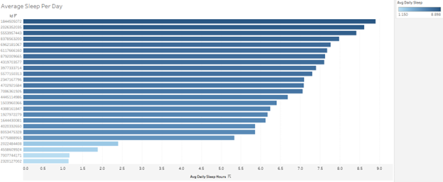
   * Most users get between 5-9 hours of sleep per night. 23/30 users wore their watch to bed in this dataset. This shows that the sleep tracking function is used by the majority of Fitbit users. Bellabeat should have a sleep tracking feature and market this feature to their users.
### Phase 5 and 6: Share and Act
* Are users wearing the watch as a fashionable accessory? Do they wear it all day?
   * 
   * Yes, most users wear their watch all day. I recommend that we market our product to users who are looking for a fashionable watch. We should also make sure our watch is fashionable enough to be worn all day.
* Do users frequently log their weight in the device?
   * 
   * Only a very small percentage of Fitbit users use the weight log function. Further investigation is needed to find out why. This may not be a strong area of focus for our product until that investigation is done. 
* What time of day do users typically exercise?
   * 
   * Users burn the most calories at 7PM each day. I would recommend that we market to working professionals with this time frame in mind. We should also create a watch that fits a professional dress code to accommodate these users.
* How far do users go per day?
   * 
   * Most users fall between 0-9 Km per day. We should design a watch that is user friendly for runners and walkers and has an effective mileage tracker.
* How much sleep do the users get per night?
   * 
   * Most users get between 5-9 hours of sleep per night. 23/30 users wore their watch to bed in this dataset. Bellabeat should have a sleep tracking feature and market this feature to their users.
