# Coursera_Case_Study
I analyze the data of Fitbit users to derive marketing insights for my stakeholders. This is a case study for my Google Data Analytics Certificate.
## Prompt
* You are a data analyst for a company called Bellabeat. Bellabeat makes wearable fitness devices.
* Your team has been asked to anazlyze trends in smart fitness device usage in an effort to help Bellabeat reach their target market more effectively.
* This data set about fitbit users is provided by the company: [https://www.kaggle.com/datasets/arashnic/fitbit]
* Questions:
    * What are some trends in smart device usage?
    * How could these trends apply to Bellabeat's customers?
    * How could these trends influence Bellabeat's marketing strategy?
### Phase One: Ask
* Are users wearing the watch as a fashionable accessory? Do they wear it all day?
* Do users frequently log their weight in the device?
* What time of day do users typically exercise?
* How far do users go during a workout?
* How long do users workout for?
* How hard do users workout?
* How much sleep do the users get per night?
### Phase Two: Prepare
* Is the data reliable?
    * For purposes of this case study, I will use this data set. However, it is important to note the we are trying to make a claim about Fitbit users. Therefore, our population would be 38.5 million people. If we wanted to make claims about this population with 95% certainty, we would need a sample size of at least 385 participants. If this were a real life scenario, I would recommend that we find a more representative data set.
    * Further, the source of this data is Amazon Mechanical Turk. Therefore, this dataset is not random and it was not vetted for bias.
* Is the data the original set?
    * Yes
* Is the data comprehensive?
    * The data includes enough information to allow us to answer our questions about the users included.
* Is the data current?
    * This data set is updated annually.
### Phase Three and Four: Process and Analyze
* Are users wearing the watch as a fashionable accessory? Do they wear it all day?
    * For this task, I used the heartrate_seconds_merged.csv tables. There is one for the first date range (3/12-4/11), and one for the second date range (4/12-5/12). A preview of this table is shown below. A user must be wearing the watch for their heartrate to be tracked. Therefore, this table will show us how long each user wears their watch:
    * 
    * First, I cleaned this data by formatting the id’s to a number and expanded the date row to include all information.
    * Second, I uploaded the tables to Bigquery.
    * Third, I applied the following steps to the datasets for both date ranges:
         * I found the number of days that each user was wearing their fitbit during the date range.
            * To do this, I applied the following SQL query to the heartrate table:
            * 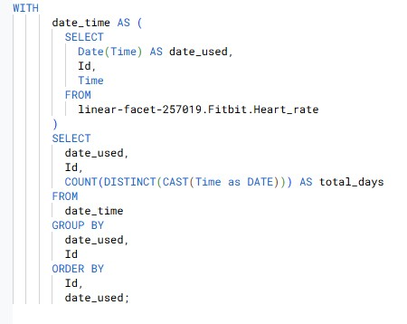
            * Below is the table created by this query:
            * 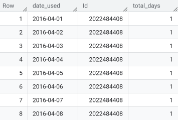
                 * I then ran the following query on the table above to find the total number of days per user during the range:
                 * 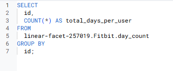
                 * Below is the table that resulted from running this query:
                 * 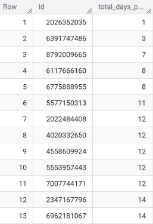
         * Now that I knew the total number of days per user for this date range, I needed to find the number of hours that each user wore the watch during the date range.
            *  To do this, I ran the following query on the original heart rate table:
            *  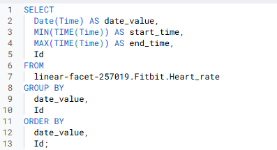
            *  This resulted in the following table with the start and end time on each day for each user:
            *  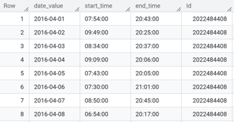
            *  Then, I ran the following query on the table above to add the total duration per user:
            *  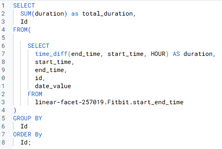
            *  This resulted in the following table:
            *  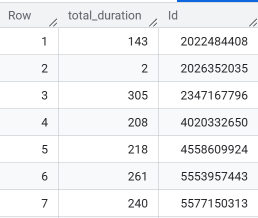
            *  I joined this table with the day count table using the following query:
            *  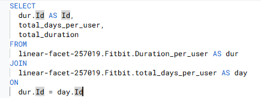
            *  This resulted in a table that shows the Fitbit Id, total days the fitbit was used, and the total hours the fitbit was used. Below is a snip of the table for the 3/12-4/11 dataset:
            *  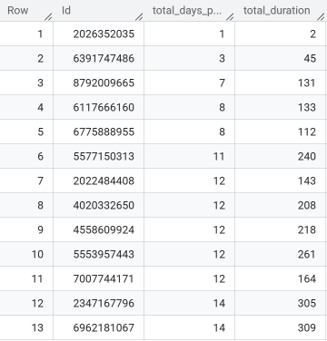
         * Since I applied these steps to both date ranges, I ended up with 2 tables.
            * I combined these tables in Excel and added.  
            * In a new tab, I used a sumif function to total the number of hours per user in one column and the number of days per user in another.
               * I added a third column that divides the hours used by the days used to find each user's average daily use.
            * In a new sheet, I created a table that used a countif function to add the number of users that fell within each usage range as shown below:
            *  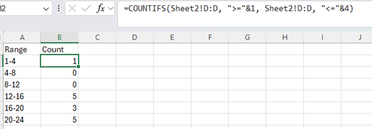
            * I used Excel to create a chart from this table as shown below:
            * 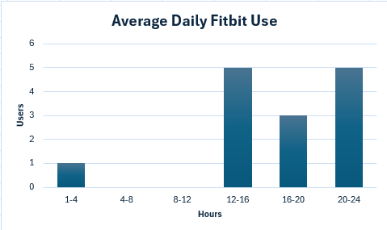
   * This chart shows us that most fitbit users wear their watch between 12 and 24 hours per day. My recommendation to my stakeholders would be to market their product to users who are looking for a fashionable watch that they can wear all day, not just while working out.
* How often are users utilizing the weight log function?
   * To answer this, I prepared the weight log data sets by extracting the date from the column with Date-Time using flash fill in Excel. Then, I used the following sql query to merge the two tables, and count the number of distinct id’s that fell within each date range. This showed the number of unique user Id's that used the weight log each week. I chose to measure this on a weekly basis because this is a common weigh in frequency for someone who is trying to lose weight.
   * 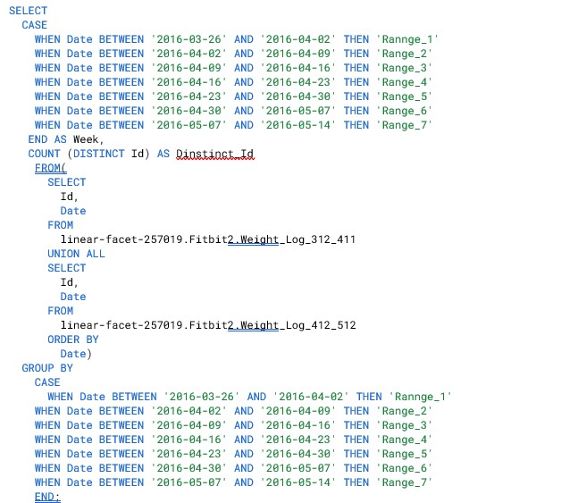
   * This query created a table that I opened in Excel. In Excel, I added a percentage column that divided the number of unique users each week by the population size (30), and created a chart that plotted the weekly percentages on a line graph as shown below:
   * 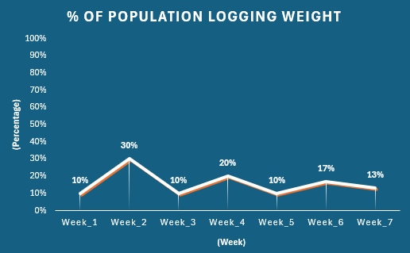
* The chart above shows that only a very small percentage of our population is using the weight log function. Based on this data, I would recommend that we investigate why this function is not being used. It could mean that only a small percentage of our population is trying to lose weight. Alternatively, it could also mean that the weight log funtion is not easy to use. We could search for datasets that shed light on the percentage of Fitbit users that use the device for weightloss or create a survey that attempts to uncover how Fitbit users feel about the weight log function. This information could provide valuable information about whether or not we should market to people who are trying to lose weight. Depending on what we find, it could also mean a step toward improving the weight log function for our device.
